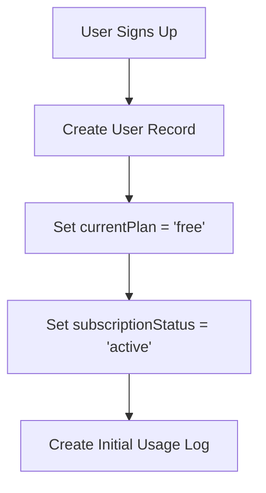
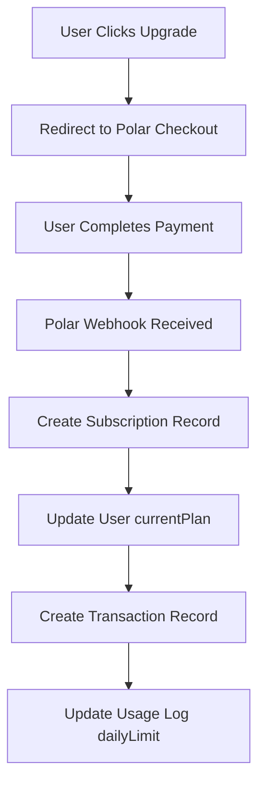
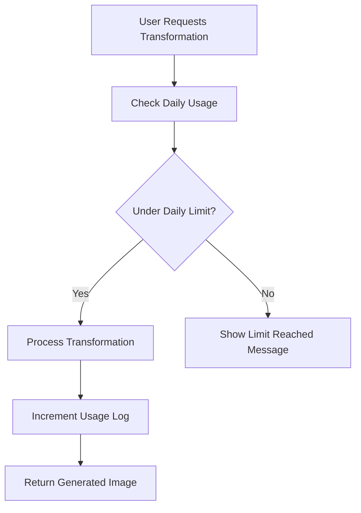
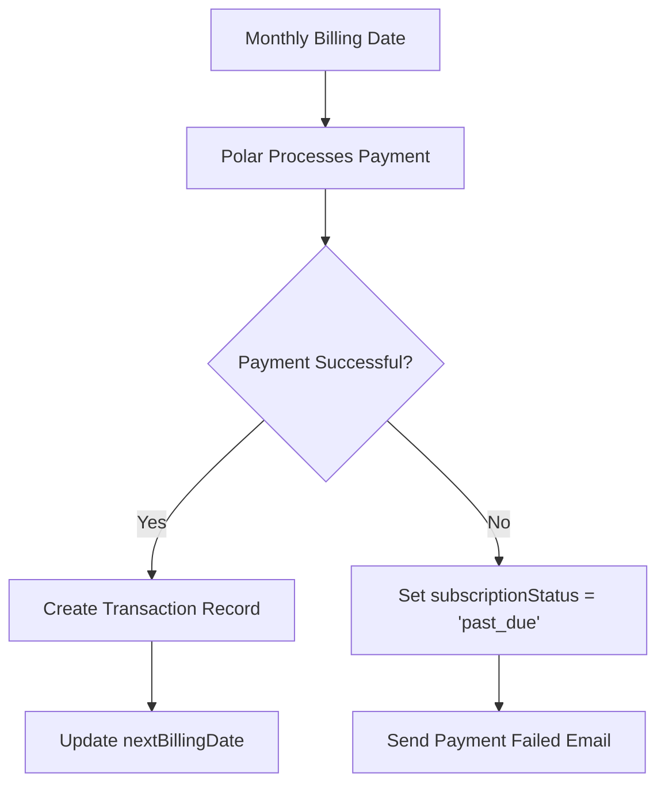

# Subscription System Design Documentation

## 📋 Overview

This document outlines the design and implementation of a professional subscription system for Time Lens, supporting three plans (Free, Basic, Pro) with monthly billing, usage tracking, and upgrade/downgrade capabilities.

## 🎯 Requirements

### Plan Structure
- **Free Plan**: 2 image transformations per day
- **Basic Plan**: 50 image transformations per day (or unlimited with reasonable limits)
- **Pro Plan**: Unlimited image transformations
- **Billing**: Monthly only (no yearly, no trials)
- **Payment Provider**: Polar integration

### Business Rules
- Users can upgrade/downgrade between plans
- Usage is tracked daily with plan-specific limits
- Failed payments result in "past_due" status
- Cancelled subscriptions preserve user data
- No free trials or enterprise plans

## 🗄️ Database Schema Design

### 1. User Model Extensions

**Current User Model** (from Better Auth):
```prisma
model User {
  id            String    @id
  name          String
  email         String
  emailVerified Boolean
  image         String?
  createdAt     DateTime
  updatedAt     DateTime
  sessions      Session[]
  accounts      Account[]
  images        Image[]
}
```

**New Fields to Add**:
```prisma
model User {
  // ... existing fields ...
  
  // Subscription Management
  currentPlan           String    @default("free") // "free", "basic", "pro"
  subscriptionStatus    String    @default("active") // "active", "cancelled", "past_due"
  polarCustomerId      String?   // Polar customer identifier
  subscriptionStartDate DateTime?
  subscriptionEndDate   DateTime?
  nextBillingDate       DateTime?
  
  // Relations
  subscriptions Subscription[]
  transactions  Transaction[]
  usageLogs     UsageLog[]
}
```

### 2. Subscription Model

```prisma
model Subscription {
  id                String   @id // Polar subscription ID
  userId            String
  user              User     @relation(fields: [userId], references: [id], onDelete: Cascade)
  
  planType          String   // "basic", "pro"
  status            String   // "active", "cancelled", "past_due"
  startDate         DateTime
  endDate           DateTime?
  nextBillingDate   DateTime
  polarCustomerId   String
  
  createdAt         DateTime @default(now())
  updatedAt         DateTime @updatedAt
  
  // Relations
  transactions      Transaction[]
  
  @@index([userId])
  @@index([status])
  @@index([nextBillingDate])
  @@map("subscription")
}
```

### 3. Transaction Model

```prisma
model Transaction {
  id              String   @id // Polar order ID
  userId          String
  user            User     @relation(fields: [userId], references: [id], onDelete: Cascade)
  
  subscriptionId  String?
  subscription    Subscription? @relation(fields: [subscriptionId], references: [id], onDelete: SetNull)
  
  amountCents     Int      // Store in cents for precision
  currency        String   @default("USD")
  status          String   // "paid", "failed", "refunded"
  transactionType String   // "subscription_start", "recurring", "upgrade", "downgrade"
  
  createdAt       DateTime @default(now())
  
  @@index([userId])
  @@index([subscriptionId])
  @@index([status])
  @@index([createdAt])
  @@map("transaction")
}
```

### 4. Usage Log Model

```prisma
model UsageLog {
  id                    BigInt   @id @default(autoincrement())
  userId                String
  user                  User     @relation(fields: [userId], references: [id], onDelete: Cascade)
  
  date                  DateTime @db.Date
  transformationsCount  Int      @default(0)
  planType              String   // "free", "basic", "pro"
  dailyLimit            Int      // 2 for free, 50 for basic, -1 for pro (unlimited)
  
  createdAt             DateTime @default(now())
  
  @@unique([userId, date])
  @@index([userId])
  @@index([date])
  @@index([planType])
  @@map("usage_log")
}
```

## 🔗 Relationships

### Entity Relationship Diagram
```
User (1) ←→ (Many) Subscription
User (1) ←→ (Many) Transaction
User (1) ←→ (Many) UsageLog
Subscription (1) ←→ (Many) Transaction
```

### Key Relationships Explained

1. **User → Subscription**: One user can have multiple subscription records (for upgrade/downgrade history)
2. **User → Transaction**: One user can have multiple payment transactions
3. **User → UsageLog**: One user has one usage log per day
4. **Subscription → Transaction**: One subscription can have multiple transactions (initial + recurring)

## 💰 Plan Configuration

### Plan Limits Configuration
```typescript
export const PLAN_LIMITS = {
  free: {
    dailyTransformations: 2,
    quality: 'standard',
    support: 'community',
    price: 0
  },
  basic: {
    dailyTransformations: 50,
    quality: 'standard', 
    support: 'email',
    price: 999 // $9.99 in cents
  },
  pro: {
    dailyTransformations: -1, // unlimited
    quality: 'premium',
    support: 'priority',
    price: 1999 // $19.99 in cents
  }
} as const;

export type PlanType = keyof typeof PLAN_LIMITS;
```

### Polar Product Mapping
```typescript
export const POLAR_PRODUCTS = {
  basic: {
    productId: process.env.POLAR_BASIC_PRODUCT_ID!,
    slug: "Basic"
  },
  pro: {
    productId: process.env.POLAR_PRO_PRODUCT_ID!,
    slug: "Pro"
  }
} as const;
```

## 🔄 Business Logic Flow

### 1. User Registration


### 2. Plan Upgrade Flow


### 3. Usage Tracking Flow


### 4. Billing Cycle Flow


## 🛠️ Implementation Steps

### Phase 1: Database Schema (Week 1)
1. **Update Prisma Schema**
   - Add new fields to User model
   - Create Subscription, Transaction, UsageLog models
   - Add proper indexes and relationships

2. **Create Migration**
   - Generate Prisma migration
   - Test migration on development database
   - Deploy to production

3. **Update Prisma Client**
   - Regenerate Prisma client
   - Update TypeScript types

### Phase 2: Core Services (Week 2)
1. **Subscription Service**
   - Create `SubscriptionService` class
   - Handle plan upgrades/downgrades
   - Manage subscription status

2. **Usage Service**
   - Create `UsageService` class
   - Track daily usage
   - Enforce plan limits

3. **Transaction Service**
   - Create `TransactionService` class
   - Handle payment records
   - Process Polar webhooks

### Phase 3: API Integration (Week 3)
1. **Polar Webhook Handler**
   - Process subscription events
   - Update database records
   - Handle payment failures

2. **Usage API**
   - Check usage limits
   - Track transformations
   - Return usage statistics

3. **Subscription API**
   - Get current plan status
   - Handle plan changes
   - Manage billing information

### Phase 4: UI Updates (Week 4)
1. **Profile Page**
   - Show real subscription data
   - Display usage statistics
   - Handle upgrade/downgrade flows

2. **Dashboard**
   - Show usage warnings
   - Display plan benefits
   - Handle limit reached states

3. **Pricing Page**
   - Integrate with Polar checkout
   - Show plan comparisons
   - Handle upgrade flows

## 🔒 Security Considerations

### Data Protection
- **Encrypt sensitive data** (payment info, customer IDs)
- **Audit trails** for all subscription changes
- **Rate limiting** for API endpoints
- **Input validation** for all user inputs

### Payment Security
- **Webhook signature verification** for Polar events
- **Idempotency** for webhook processing
- **Error handling** for failed payments
- **Grace periods** for past due accounts

## 📊 Analytics & Monitoring

### Key Metrics to Track
- **Monthly Recurring Revenue (MRR)**
- **Churn Rate** (cancellation rate)
- **Conversion Rate** (free to paid)
- **Usage Patterns** (peak times, popular features)
- **Payment Success Rate**

### Monitoring Alerts
- **Failed payments** above threshold
- **High churn rate** detection
- **Usage spikes** or anomalies
- **API errors** or webhook failures

## 🧪 Testing Strategy

### Unit Tests
- **Plan limit enforcement**
- **Usage tracking accuracy**
- **Subscription status changes**
- **Transaction processing**

### Integration Tests
- **Polar webhook processing**
- **Payment flow end-to-end**
- **Upgrade/downgrade scenarios**
- **Usage limit enforcement**

### E2E Tests
- **Complete subscription flow**
- **Payment processing**
- **Usage tracking**
- **Plan changes**

## 📈 Future Enhancements

### Phase 2 Features (Post-Launch)
- **Yearly billing** options
- **Free trial** periods
- **Enterprise plans** with custom pricing
- **Usage analytics** dashboard
- **Automated billing** reminders
- **Referral system** with credits

### Advanced Features
- **Usage-based billing** (pay per transformation)
- **Team accounts** with shared billing
- **API access** for enterprise customers
- **White-label** solutions
- **Advanced analytics** and reporting

## 🚀 Deployment Checklist

### Pre-Launch
- [ ] Database schema deployed
- [ ] Polar webhooks configured
- [ ] Payment flows tested
- [ ] Usage tracking verified
- [ ] Error handling implemented
- [ ] Monitoring alerts set up

### Launch Day
- [ ] Monitor webhook processing
- [ ] Track payment success rates
- [ ] Monitor usage patterns
- [ ] Check error logs
- [ ] Verify data integrity

### Post-Launch
- [ ] Analyze conversion rates
- [ ] Monitor churn patterns
- [ ] Gather user feedback
- [ ] Plan feature improvements
- [ ] Scale infrastructure as needed

---

**Document Version**: 1.0  
**Last Updated**: September 2024  
**Next Review**: After Phase 1 completion
